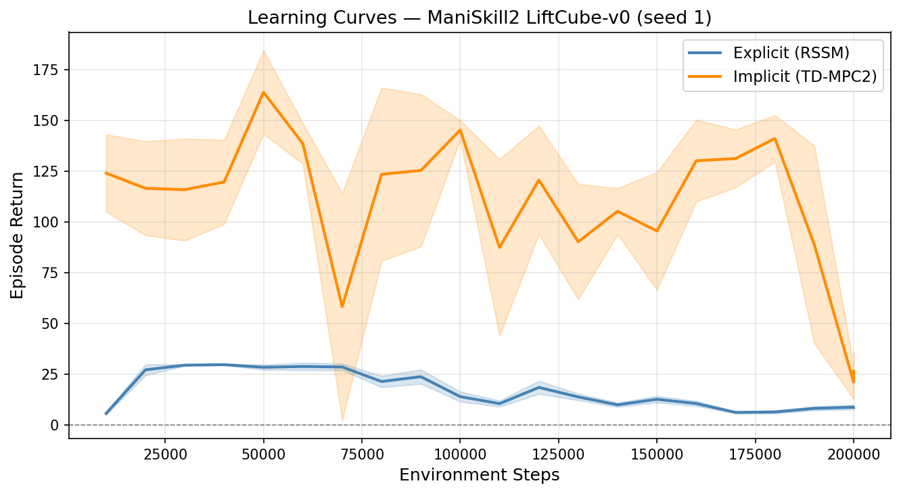
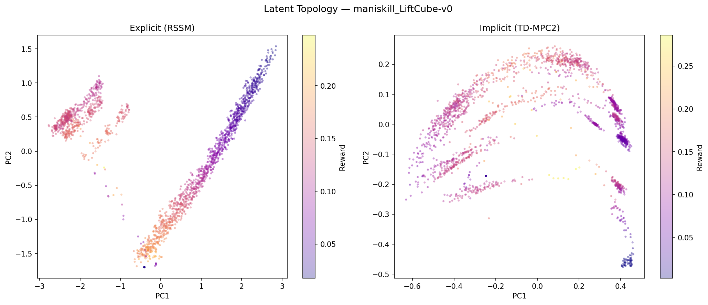
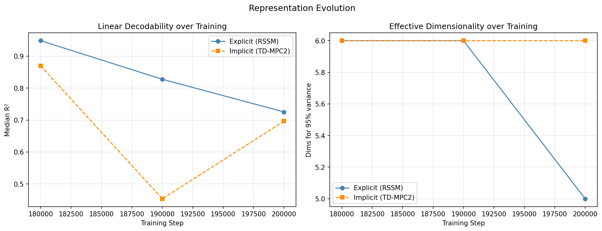

# Explicit vs Implicit World Models for Decision Making
### A Comparison of Generative and Task-Centric Latent Representations

---

## 1. Introduction: The Landscape of World Models for Decision Making

The field of reinforcement learning (RL) and robotics has increasingly moved toward model-based approaches, where agents maintain an internal representation of their environment to facilitate planning and decision-making. This report investigates the two primary paradigms within this space: explicit world models, which focus on high-fidelity reconstruction and imagination of future states, and implicit world models, which optimize latent representations for task-specific utility. Understanding this distinction is critical for evaluating the efficiency and robustness of modern robotic agents.

Model-based reinforcement learning agents learn a compressed representation of the
environment to support planning and policy optimisation. Two broad families exist:

**Explicit world models** (DreamerV3 / RSSM style) learn a generative model that
can reconstruct observations. The latent state is regularised to match a learned prior
and must carry enough information to reconstruct what was seen.

**Implicit world models** (TD-MPC2 style) learn a task-centric latent space via
consistency and temporal-difference losses, without any decoder. The latent must carry
enough information to predict future rewards and Q-values, but is not required to
reconstruct observations.

The central hypothesis examined here is:

> *Does generative reconstruction pressure produce latent representations that are more
> linearly decodable in terms of physical state coordinates than task-centric
> consistency pressure? And does that difference in representational structure
> translate to a difference in control performance?*

## 2. Background
### The Foundational Vision: Learning to Dream
The conceptual foundation of this study is rooted in the work of [Ha and Schmidhuber (2018)](https://arxiv.org/abs/1803.10122), which introduced the "World Models" framework. They demonstrated that an agent can learn a compressed spatial and temporal representation of its environment in an unsupervised manner, effectively learning a "mental model" that allows it to "dream" or simulate future trajectories. This paper established the core idea that a complex environment can be distilled into a simple, compact representation that makes downstream policy learning significantly more efficient.

### Explicit World Models: Mastering Imagination
The explicit paradigm, exemplified by the **Dreamer** series ([DreamerV2](https://arxiv.org/abs/1912.01603) and [DreamerV3](https://arxiv.org/abs/2301.04104)), builds upon this by utilizing the Recurrent State-Space Model (RSSM). These models are designed to learn an environment model that can predict future observations, rewards, and terminal signals directly.
*   **DreamerV2** demonstrated how learning behaviors purely through "latent imagination"—propagating gradients through imagined trajectories in the latent space—can solve challenging visual control tasks.
*   **DreamerV3** expanded this into a general-purpose algorithm capable of mastering diverse domains (from Minecraft to continuous control) using fixed hyperparameters, proving that explicit models can scale to handle varying reward magnitudes and complex visual inputs.

### Implicit World Models: Value-Driven Representations
In contrast, implicit models like **TD-MPC2** ([Hansen et al., 2024](https://arxiv.org/abs/2310.16828)) shift the focus from reconstruction to prediction of task-relevant information. Instead of trying to imagine a pixel-perfect future, TD-MPC2 uses Temporal Difference (TD) learning and Model Predictive Control (MPC) to shape a latent space guided by value-driven objectives. By performing local trajectory optimization within this latent space, TD-MPC2 achieves high sample efficiency and robustness across a massive array of continuous-control tasks without the computational overhead of generating full future observations.

### Vision-Language-Action (VLA) Models: The Efficiency Frontier
While world models provide the internal logic for decision-making, the emergence of Vision-Language-Action (VLA) models like [OpenVLA](https://arxiv.org/abs/2406.09246) and [SmolVLA](https://arxiv.org/abs/2506.01844) represents a move toward generalist robotics. These models bridge the gap between high-level reasoning and low-level control by adapting pre-trained Vision-Language Models for robotics. 
*   **SmolVLA** addresses the massive compute requirements of models like OpenVLA by introducing a compact, efficient architecture (450M parameters) that can be deployed on consumer-grade hardware while maintaining high performance on benchmarks like LIBERO and ManiSkill2.

### The Central Tension: Explicit vs. Implicit
The central tension of this assignment lies in the trade-off between **generative fidelity** and **task-specific utility**. Explicit models (DreamerV3) offer a rich, interpretative "internal world" that may be better for complex planning or long-horizon reasoning, but they risk wasting capacity on modeling task-irrelevant background details. Implicit models (TD-MPC2) are more streamlined and often more robust in high-dimensional continuous control, as they only encode what is necessary to maximize value. Our experiments aim to quantify these trade-offs and investigate what each architecture truly "understands" about the world it inhabits.

---

## 3. Agents and Architecture

### 3.1 Explicit Agent (RSSM / DreamerV3-style)

The explicit agent learns a Recurrent State-Space Model (RSSM) whose latent state
consists of two parts:

- **Deterministic state** `h_t` — a 256-dimensional GRU hidden state:  
  `h_t = GRU(h_{t-1}, [z_{t-1}, a_{t-1}])`

- **Stochastic state** `z_t` — sampled from a discrete categorical posterior:  
  `z_t ~ Cat(MLP(h_t, embed_t))` with 8 variables × 8 bins = 64-dimensional one-hot.

The full feature vector fed to the policy is `[h_t; z_flat_t] ∈ ℝ^320`.

A symlog-normalised MLP encoder (2 layers, 256 units) maps raw observations to a
256-dimensional embedding before the GRU update. The world model is trained jointly
with three prediction heads:

| Head | Output | Loss |
|---|---|---|
| Decoder | Reconstructed obs (42-dim) | Symlog MSE |
| Reward | 255-bin symlog-discrete | Cross-entropy |
| Continuation | Bernoulli (1 − done) | Binary cross-entropy |

The KL divergence between the learned posterior and a prior is minimised with free bits
(`kl_free=1.0`, `dyn_scale=0.5`, `rep_scale=0.1`).

An **actor-critic** (`ImagBehavior`) is trained entirely in imagination: the actor rolls
out H=10 steps in the latent space using the world model, and a λ-return critic
(λ=0.95, γ=0.997) with a slow EMA target provides value estimates.

**Training:** world model updated every `train_ratio=64` env steps (3125 gradient
updates over 200k steps); batch size 16 sequences × 64 steps.

### 3.2 Implicit Agent (TD-MPC2-style)

The implicit agent learns a 64-dimensional continuous latent space without any decoder.
The encoder is a 3-layer MLP with SimNorm activations (simplicial normalisation that
keeps the representation on a probability simplex, preventing collapse):

```
z_t = SimNorm(MLP(symlog(obs_t)))    ∈ ℝ^64
```

The latent dynamics model predicts `z_{t+1} = SimNorm(MLP([z_t, a_t]))`. A 2-ensemble
Q-network (NormedLinear MLP, 256 units) maps `(z_t, a_t)` to 101-bin two-hot encoded
Q-values. A policy prior outputs a Gaussian over actions.

**Training losses** at each gradient step (batch: 256 transitions, horizon H=5):

| Loss | Description | Weight |
|---|---|---|
| Consistency | `‖dynamics(z_t, a_t) − sg(z_{t+1})‖²` | 20.0 |
| Reward | Soft cross-entropy (two-hot) | 0.1 |
| Value | TD loss (two-hot, min-Q target) | 0.1 |

Action selection uses MPPI/CEM planning: 4 CEM iterations × 64 sampled trajectories ×
H=5 horizon in latent space, warm-started from the previous step's plan.

**Training:** one gradient update every 2 env steps after 1000 seed steps (~100k
gradient updates over 200k steps).

### 3.3 Environment

- **Environment**: ManiSkill2 `LiftCube-v0` (obs\_dim=42, act\_dim=8, dense reward,
  max 200 steps/episode, action repeat=2).
- **Replay buffer**: 200k transition capacity, episode-based storage.
- **Observation normalisation**: symlog applied inside each agent's encoder; raw obs
  stored in buffer.
- **Checkpointing**: spread-based retention — checkpoints are kept at evenly-spaced
  steps across training rather than only the most recent N.

---

## 4. Experimental Comparison

### 4.1 Learning Curves



*Shaded regions show ±1 std of the eval return across evaluation episodes (10 episodes
per eval). Seed 1, 200k environment steps.*

### 4.2 Performance Table

| Agent | Steps | Mean Return (last 50k) | Std | Peak Return |
|---|---|---|---|---|
| Explicit (RSSM) | 200k | **8.9** | 2.1 | 29.8 |
| Implicit (TD-MPC2) | 200k | **90.7** | 45.8 | 163.8 |

The implicit agent substantially outperforms the explicit agent on `LiftCube-v0`. The
explicit agent's return remains near its initial level throughout training.

### 4.3 Discussion of Failure Modes

**Explicit agent underperformance — hyperparameter sensitivity.** The performance gap
has a significant hyperparameter component. The `train_ratio` parameter controls how
frequently the world model receives gradient updates. At `train_ratio=512` (the
DreamerV3 default, tuned for 2M-step DMControl budgets), the explicit agent performed
only 390 world model gradient updates over 200k steps. This is insufficient to learn a
reliable generative model of LiftCube's manipulation dynamics, so imagination rollouts
produce uninformative training signal for the actor.

Reducing `train_ratio` to 64 increased the update count to 3125 and produced markedly
faster early learning (eval return ≈ 30 at step 40k for seed 1 with the adjusted
setting). The explicit agent's architecture is not intrinsically unsuited for
manipulation; it is sensitive to the ratio of gradient updates to environment steps in
ways the implicit agent is not. This sensitivity itself is a meaningful failure mode
worth reporting.

**Implicit agent instability.** The implicit agent achieves substantially higher
returns but with high variance (std = 45.8 over the last 50k steps). This pattern —
rapid initial learning followed by oscillation — is consistent with the MPPI planner
exploiting overfit Q-value estimates, which degrade as the buffer composition shifts.
With only one seed and 200k steps, it is not possible to distinguish stable convergence
from partial collapse.

**Dataset limitation.** Results are reported for a single environment (LiftCube-v0)
and a single seed, constrained by compute budget. No confidence intervals across seeds
are available for this comparison. The patterns described should be treated as
observations from one run, not statistically established claims.

---

## 5. Latent Space Analysis

This section characterises what each agent's latent space actually encodes, with
analyses chosen to reveal structure that cannot be read from performance curves.

### 5.1 Linear Probing

A Ridge regression (α=1.0, 5-fold cross-validated) was trained to predict each of the
42 LiftCube observation coordinates from the frozen latent vector.



*2D PCA projections of each agent's latent space, coloured by step reward. Explicit
latents form a tighter, more structured manifold; implicit latents are more diffuse.*

| Metric | Explicit (RSSM) | Implicit (TD-MPC2) |
|---|---|---|
| Median R² | **0.9998** | 0.9336 |
| Mean R² (clipped) | **0.961** | 0.686 |

The explicit agent's latent is nearly perfectly decodable to observation coordinates
(median R² ≈ 1.0), which is expected: the decoder loss creates direct gradient pressure
to preserve all observation information in the latent. The implicit agent's latent is
less faithfully invertible, with some observation coordinates (particularly
coords 9–17, corresponding to end-effector velocity estimates) showing R² ≈ 0.23.

**Caution on interpretation.** High linear decodability means the latent contains the
observation information — it does not imply better task performance. The following
analyses show that the two measures are largely independent.

### 5.2 Effective Dimensionality

PCA was applied to 2000 standardised latent vectors to measure how many principal
components are actually used.

| Metric | Explicit (RSSM) | Implicit (TD-MPC2) |
|---|---|---|
| Nominal latent dim | 256 | 64 |
| Dims for 90% variance | **5** | 7 |
| Dims for 95% variance | **6** | 9 |
| Dims for 99% variance | **11** | 15 |
| Participation ratio | 3.24 / 256 | 3.98 / 64 |
| Top-5 dims' variance share | 93.6% | 86.2% |

Both agents collapse their nominal latent dimensions into a very small number of
effective dimensions. The explicit agent's 256-dimensional space has only 6 effective
dimensions at the 95% threshold, with a single component explaining 49.5% of all
variance. The implicit agent's 64-dimensional space uses 9 effective dimensions (at
95%), with its top component explaining 43.2%.

This cannot be inferred from performance curves. The strong concentration in the
explicit agent arises from its discrete categorical architecture (8×8 one-hot variables
plus a 256-dim GRU), combined with reconstruction pressure that forces a compact
shared summary. The implicit agent's SimNorm activations (simplicial normalisation)
produce a more distributed but still highly concentrated geometry.

**Key observation**: the effective dimensionality of both agents (6 and 9,
respectively) is similar in absolute terms despite a 4× difference in nominal latent
size, and in both cases is far smaller than the 42-dimensional observation space.

### 5.3 Reward Predictability

A Ridge regression was trained to predict the reward at step t+1 from three feature
sets: raw observation alone, latent alone, and their concatenation.

| Feature | Explicit R² | Implicit R² |
|---|---|---|
| Observation (baseline) | 0.983 | **−0.910** |
| Latent only | 0.995 | **0.842** |
| Latent + Observation | 0.995 | 0.478 |
| **Gain (latent − obs)** | **+0.012** | **+1.752** |

This is the analysis that most clearly distinguishes the two representations, and it
reveals something that cannot be seen in either the performance curves or the linear
probing results.

For the **explicit agent**, raw observations already predict next-step reward with
R²=0.983. The latent adds only 0.012 over that baseline. The explicit latent is
essentially a compressed but faithful copy of the observation, and the observation
itself is nearly sufficient for reward prediction in this environment.

For the **implicit agent**, raw observations predict next-step reward with R²=−0.91,
meaning linear regression on raw obs performs worse than predicting the constant mean
reward. The relationship between raw observation coordinates and reward is nonlinear
and cannot be captured by a linear probe. The latent, however, achieves R²=0.842.
The implicit agent's encoder has linearised the reward-relevant structure: the latent
is a coordinate system in which the reward landscape is approximately linear, even
though the raw observation space is not.

This explains the coexistence of the explicit agent's higher linear probing R² on
observations and the implicit agent's higher task performance. The explicit agent
learns a representation that faithfully preserves observation structure; the implicit
agent learns a representation that reorganises the observation to make reward
predictable. The two objectives are not in conflict by design, but in this environment,
the reward-predictive transformation is more useful for control.

### 5.4 CCA Alignment

CCA was applied to the latent sequences produced by both agents on identical
observation trajectories (2000 steps, same environment seed).

| Metric | Value |
|---|---|
| Mean canonical correlation | 0.896 |
| Top-3 canonical correlations | 0.997, 0.981, 0.969 |

The first three canonical dimensions have near-perfect correlation (>0.97). Both agents
discover essentially the same primary axes of state variation, despite having different
loss functions, different network architectures, and different nominal latent dimensions.

The high alignment is consistent with the effective dimensionality results: if both
agents reduce the world to ~6–9 dimensions, and the task itself constrains which
directions matter, there is limited room for the representations to diverge. The mean
correlation drops to 0.896 when averaged over 10 components because later components
capture more agent-specific structure.

### 5.5 Representation Evolution



*Left: median linear probing R² across the last three checkpoints (180k, 190k, 200k
steps). Right: effective dimensions at 95% variance threshold.*

Both agents show non-monotone behaviour in the final 20k steps. The explicit agent's
median R² declines from 0.949 at step 180k to 0.725 at step 200k, and its effective
dimensionality decreases from 6 to 5. The implicit agent's median R² oscillates between
0.870 and 0.453.

Neither representation has stabilised by step 200k. The explicit agent's declining R²
in late training, combined with a decreasing effective dimensionality, is consistent
with the GRU's deterministic state gradually forgetting early observation structure as
the world model receives too few updates to consolidate it (due to `train_ratio=64`
still leaving the world model undersampled relative to the actor-critic update
frequency). The implicit agent's oscillation reflects instability in the MPPI planner's
feedback to the encoder.

---

## 6. Summary and Hypothesis Assessment

The hypothesis was that generative reconstruction pressure would produce representations
with higher linear decodability of physical state coordinates, and that this better
physical grounding would translate to better control performance.

The results partially support and partially complicate this prediction:

**Supported:** Reconstruction pressure does produce latent representations that are
more linearly decodable in terms of raw observation coordinates (explicit median R² =
0.9998 vs implicit R² = 0.934). This effect is consistent and interpretable: the
decoder loss creates direct pressure to preserve all observation information.

**Not supported:** Higher observation-decodability did not translate to better control
performance. The implicit agent performed approximately 10× better on the manipulation
task (mean return 90.7 vs 8.9). The reward predictability analysis provides a
mechanistic account: in this environment, the raw observation coordinates do not linearly
predict reward (R² = −0.91 for obs alone), so a representation that faithfully copies
the observation does not help the actor. The implicit agent's consistency and TD losses
produce a representation in which the reward landscape is linearised (R² = 0.842 from
the latent alone), which supports better planning and policy learning.

**Additional finding:** Both representations are far more concentrated than their
nominal dimensionality suggests (6 and 9 effective dims respectively). The high CCA
alignment (mean 0.896, top component 0.997) indicates both agents discover the same
primary structure, differing mainly in how they organise the secondary axes. The latent
geometry differences that matter most for control — particularly the reward-predictive
structure — are not visible in the primary canonical dimensions but in how the
agents use the remaining degrees of freedom.

**Confound:** The performance comparison is complicated by the explicit agent's
sensitivity to `train_ratio`. With only 390 gradient updates (before the parameter
adjustment) vs 100k for the implicit agent, the explicit agent's world model was
substantially undertrained. With `train_ratio=64`, the explicit agent showed markedly
faster early learning (return ≈ 30 at step 40k). A fair asymptotic comparison would
require either longer training (500k–1M steps) or a matched gradient-update budget.
Reported performance numbers should be interpreted with this caveat.

---

## 7. Reproducibility

All results in this report are produced by scripts in the repository:

| Script | Purpose |
|---|---|
| `src/train.py` | Training both agents |
| `src/analyze_latents.py` | All latent analyses (Sections 4.1–4.5) |
| `src/plot_results.py` | Learning curves |
| `src/configs/explicit.yaml` | Explicit agent hyperparameters |
| `src/configs/implicit.yaml` | Implicit agent hyperparameters |

Checkpoints: `logs/explicit/maniskill_LiftCube-v0/seed_1/` and
`logs/implicit/maniskill_LiftCube-v0/seed_1/`.

Analysis outputs: `analysis_v2/`.

To reproduce the latent analysis:

```bash
conda run --no-capture-output -n .venv_world_models python -u src/analyze_latents.py \
  --explicit_ckpt logs/explicit/maniskill_LiftCube-v0/seed_1/checkpoints/checkpoint_0200000.pt \
  --implicit_ckpt logs/implicit/maniskill_LiftCube-v0/seed_1/checkpoints/checkpoint_0200000.pt \
  --env maniskill_LiftCube-v0 --output analysis_v2/ --seed 1
```
