# Explicit vs Implicit World Models for Decision Making
### A Comparison of Generative and Task-Centric Latent Representations

Paper: [`icml/paper.pdf`](icml/paper.pdf) · Environments: ManiSkill2 LiftCube-v0, DMControl cartpole\_swingup, walker\_walk · Seeds: 3 · Steps: 200k

---

## Overview

Model-based RL agents differ in how they shape their latent representation:

**Explicit world models** (DreamerV3 / RSSM style) learn a generative model that
reconstructs observations. The latent state must carry enough information to regenerate
what was seen, creating gradient pressure to encode all observation dimensions.

**Implicit world models** (TD-MPC2 style) learn a task-centric latent via consistency
and temporal-difference losses, with no decoder. The latent must predict future rewards
and Q-values, but is not required to reconstruct observations.

**Central question:** Does reconstruction pressure produce latent representations that
are more linearly decodable, and does that translate to better control performance?

**Answer:** No — the implicit agent achieves higher linear probing R² *and* higher task
return across all three environments. The mechanistic explanation is **KL utilisation
collapse** in the explicit agent.

---

## Results

### Task Performance (mean return, final 50k steps, 3-seed average)

| Environment | Explicit (RSSM) | Implicit (TD-MPC2) | Ratio |
|---|---|---|---|
| ManiSkill2 LiftCube-v0 | 9.1 | **19.9** | 2.2× |
| DMControl cartpole\_swingup | 91.9 | **828.6** | 9.0× |
| DMControl walker\_walk | 25.4 | **959.4** | 37.8× |

### Linear Probing R² (median over state coordinates, step 200k, 3-seed avg)

| Environment | Explicit (RSSM) | Implicit (TD-MPC2) |
|---|---|---|
| ManiSkill2 LiftCube-v0 | 0.604 | **0.927** |
| DMControl cartpole\_swingup | 0.757 | **0.971** |
| DMControl walker\_walk | 0.466 | **0.877** |

### CCA Alignment between agents (step 200k, 3-seed avg)

| Environment | Mean CCA | Top-1 CCA |
|---|---|---|
| ManiSkill2 LiftCube-v0 | 0.515 | 0.626 |
| DMControl cartpole\_swingup | 0.492 | 0.598 |
| DMControl walker\_walk | 0.509 | 0.598 |

---

## Key Findings

### 1. KL Utilisation Collapse (explicit agent failure mode)

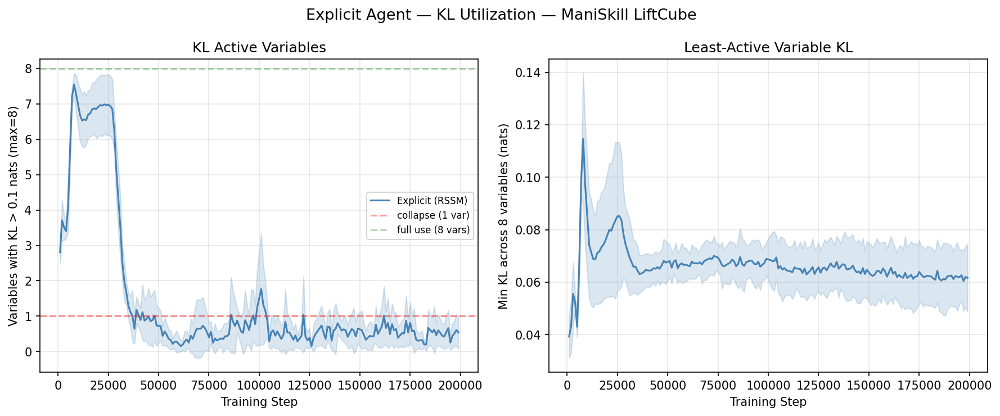

Between steps 25k–38k on LiftCube-v0, the number of active categorical variables
(`kl_active_vars`, variables with KL > 0.1 nats) crashes from 7.0 → < 0.5 and does
not recover. This coincides exactly with the performance collapse: the posterior
approaches the prior for most variables, the stochastic latent becomes near-degenerate,
and the world model loses the capacity to represent distinct observations.

The same pattern appears on all three environments and all three seeds
(see [Appendix plots](#plots)).

### 2. Implicit agent linearises the reward landscape

| Feature | Explicit R² | Implicit R² |
|---|---|---|
| Raw observation | 0.983 | −0.910 |
| Latent only | **0.995** | **0.842** |
| Gain (latent − obs) | +0.012 | **+1.752** |

The explicit latent is a compressed copy of the observation (gain +0.012).
The implicit latent reorganises the observation space so the reward function becomes
approximately linear (gain +1.752) — directly supporting planning and policy learning.

### 3. Latent geometry evolves in opposite directions

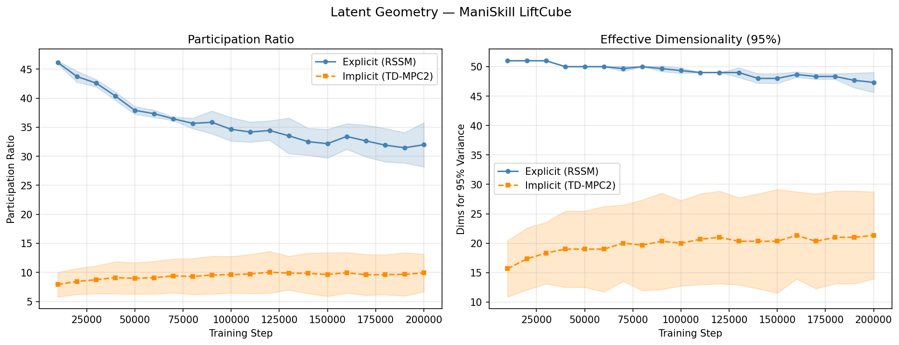

| Agent | PR at 10k | PR at 200k | dims₉₅ at 10k | dims₉₅ at 200k |
|---|---|---|---|---|
| Explicit (RSSM) | 46.1 | ~33–38 | 51 | 48–50 |
| Implicit (TD-MPC2) | 9.9 | ~13.9 | 20 | 26–28 |

The explicit participation ratio *decreases* as KL collapse reduces active variables;
the implicit participation ratio *grows* as the encoder discovers more task-relevant
structure.

### 4. Representational independence

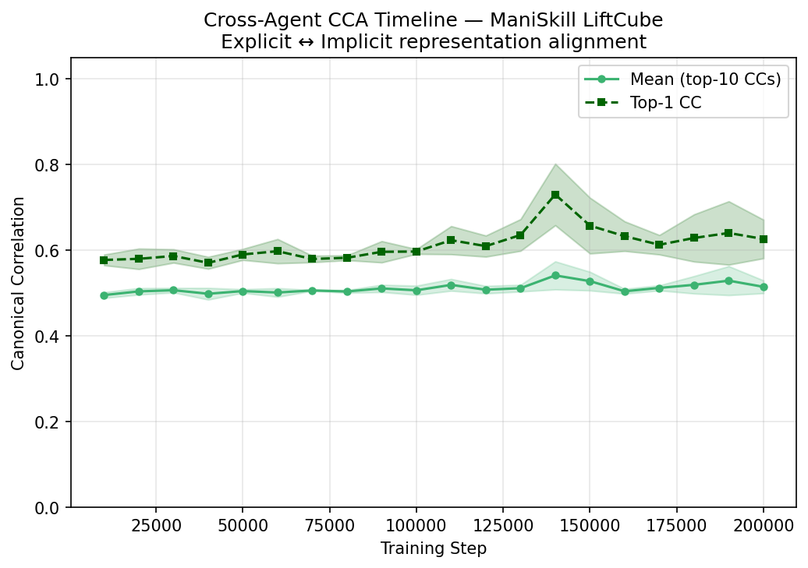

Mean CCA ≈ 0.50–0.51 across all environments — substantially lower than the near-perfect
correlation (> 0.97) found between representations trained on identical data with similar
architectures. Both agents lock in their representational bases early and do not converge
toward each other during training, despite observing identical environment trajectories.

---

## Bonus: SmolVLA Vision Encoder Comparison

SmolVLA (500M-param VLA, SigLIP vision encoder) was fine-tuned on LiftCube-v0 via LoRA
(r=16, α=32, 1000 steps, bfloat16) and its visual representations compared to both
world models on 512 paired (state, RGB) observations.

| Representation | R² | PR | dims₉₅ | dead | CCA vs implicit |
|---|---|---|---|---|---|
| Explicit (RSSM) | −1.53 | 34.4 | 46 | 0.062 | 0.69 |
| Implicit (TD-MPC2) | +0.87 | 4.4 | 7 | 0.016 | — |
| SmolVLA (SigLIP) | −3.52 | 353.8 | 407 | 0.000 | 0.49 |

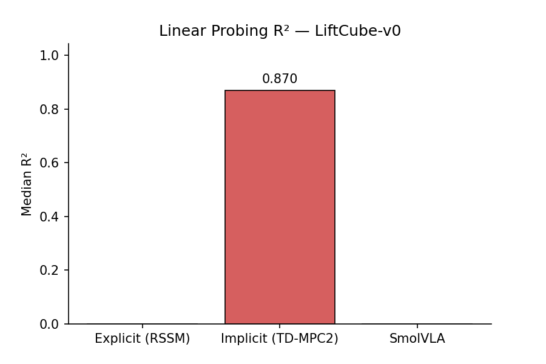
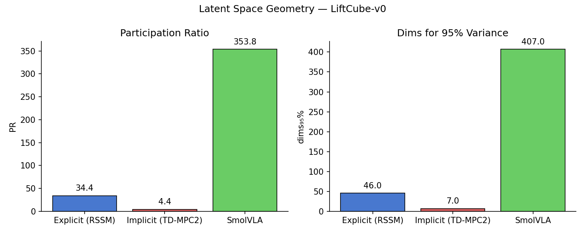
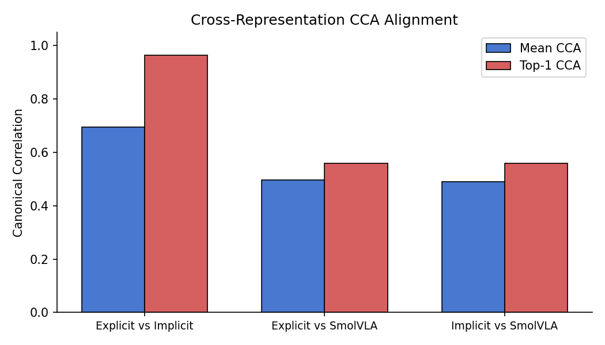

SmolVLA's SigLIP features encode rich visual semantics (PR ≈ 354, dims₉₅ = 407) rather
than metric robot state (R² = −3.52). CCA alignment with both world models is ≈ 0.49–0.50
(noise floor), confirming the two representation families are complementary, not
interchangeable.

---

## Architecture

### Explicit Agent (RSSM / DreamerV3-style)

- **Deterministic state** `h_t ∈ ℝ²⁵⁶`: GRU hidden state, `h_t = GRU(h_{t-1}, [z_{t-1}; a_{t-1}])`
- **Stochastic state** `z_t`: discrete categorical, 8 variables × 8 bins → 64-dim one-hot
- **Full feature**: `[h_t; z_t] ∈ ℝ³²⁰`
- **Prediction heads**: decoder (symlog MSE), reward (255-bin CE), continuation (binary CE)
- **KL regularisation**: free bits = 1.0, dyn_scale = 0.5, rep_scale = 0.1
- **Actor-critic**: H = 10 imagination steps, λ-return (λ=0.95, γ=0.997)
- **Update ratio**: train_ratio = 64 (~3125 WM updates over 200k steps)

### Implicit Agent (TD-MPC2-style)

- **Encoder**: 3-layer MLP + SimNorm → `z_t ∈ ℝ⁶⁴`
- **Dynamics**: `z_{t+1} = SimNorm(MLP([z_t; a_t]))`
- **Q-network**: 2-ensemble, 256 units, 101-bin two-hot Q-values
- **Losses**: consistency ×20, reward ×0.1, value ×0.1 (horizon H=5, batch 256)
- **Planning**: MPPI/CEM — 4 iterations × 64 trajectories × H=5 horizon

### Shared Infrastructure

- **Environments**: ManiSkill2 LiftCube-v0, DMControl cartpole\_swingup, walker\_walk
- **Training budget**: 200k env steps, 3 seeds each
- **Replay buffer**: 200k transitions, episode-based storage
- **Latent snapshots**: 512 transitions encoded every 10k steps → 20 temporal snapshots per run (NPZ, ~200 KB each)
- **Observation normalisation**: symlog inside each encoder

---

## Plots

### Learning Curves

| LiftCube-v0 | cartpole\_swingup | walker\_walk |
|---|---|---|
| 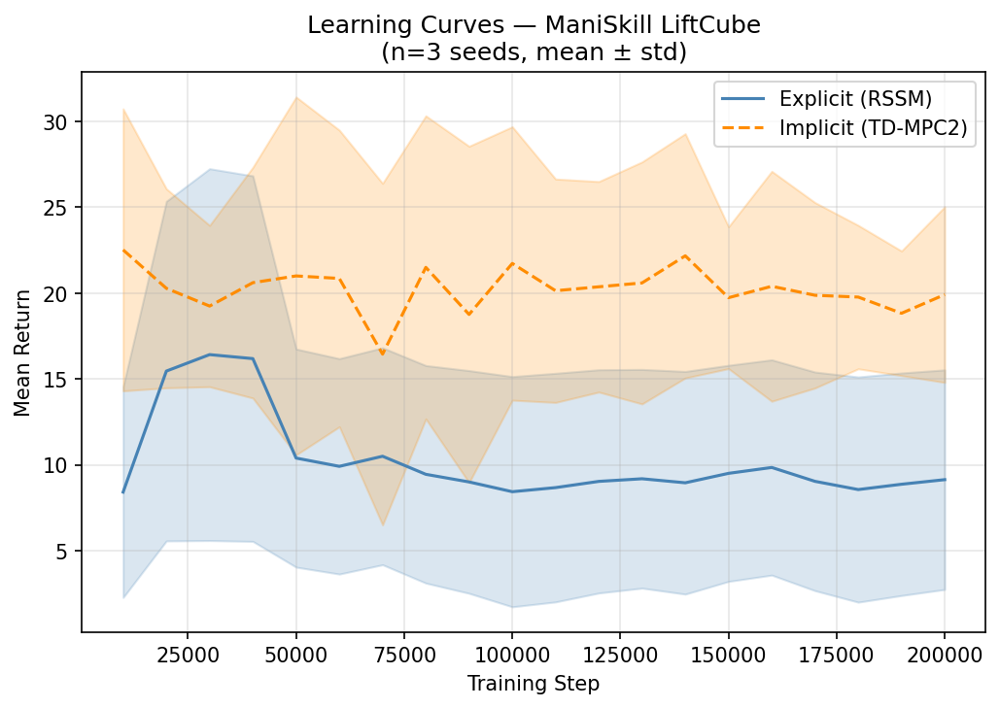 | 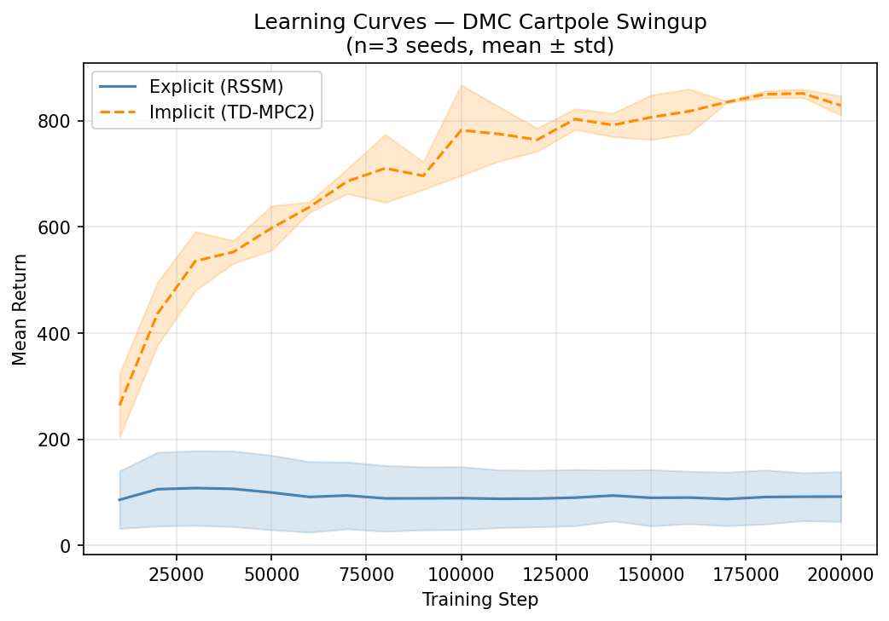 | 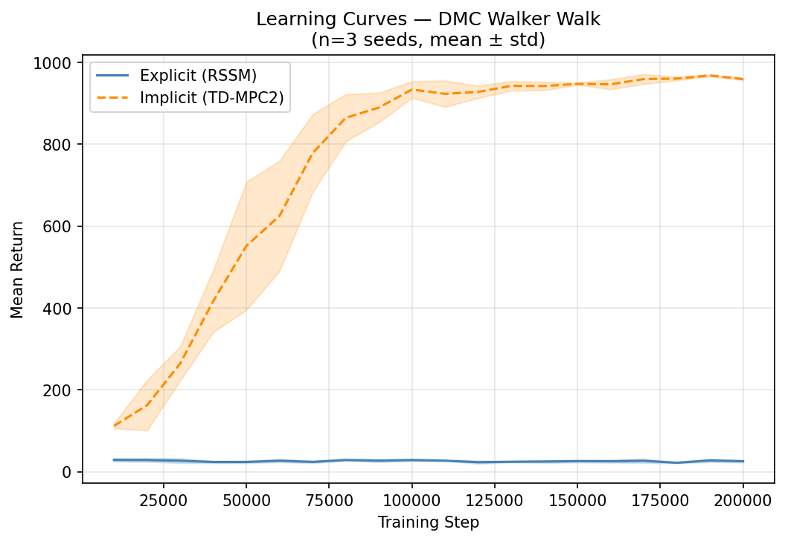 |

### KL Utilisation (explicit agent)

| LiftCube-v0 | cartpole\_swingup | walker\_walk |
|---|---|---|
|  | 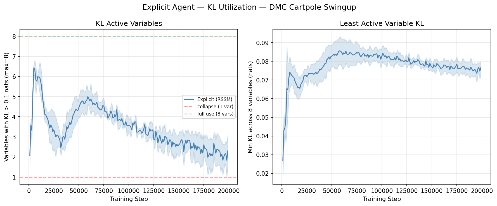 | 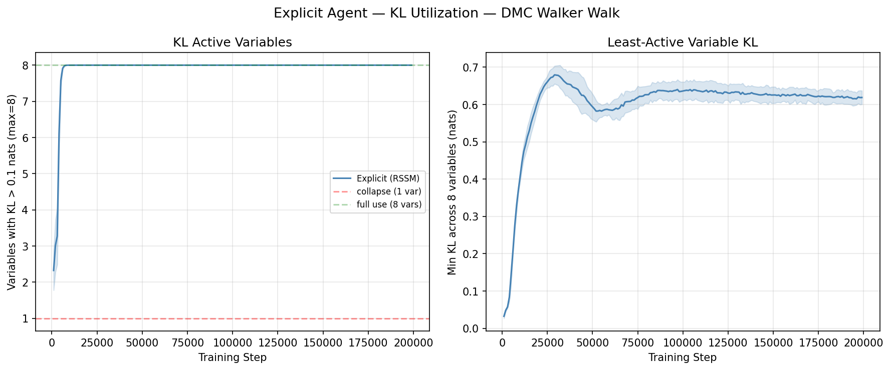 |

### Linear Probing R² Evolution

| LiftCube-v0 |
|---|
| 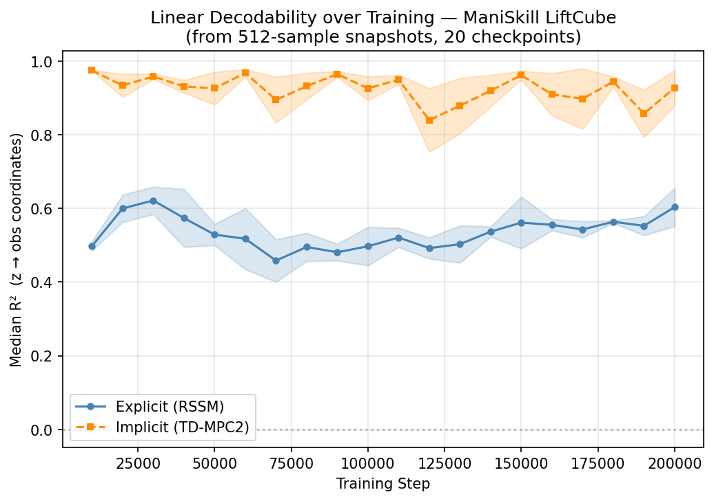 |

### Latent Geometry Evolution

| LiftCube-v0 | cartpole\_swingup | walker\_walk |
|---|---|---|
|  | 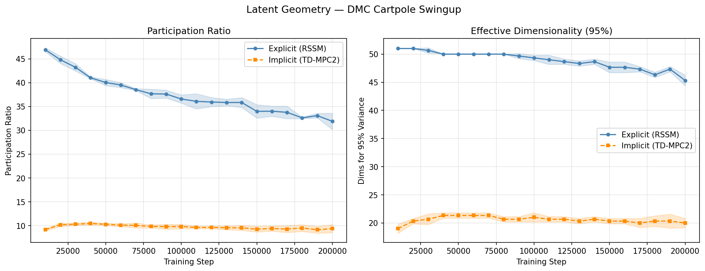 | 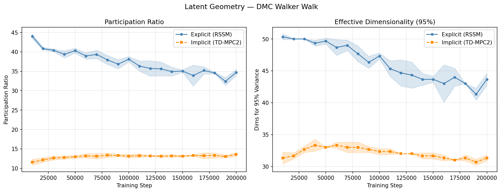 |

### CCA Alignment over Training

| LiftCube-v0 |
|---|
|  |

### MPPI Planner Health (implicit agent)

| LiftCube-v0 |
|---|
| 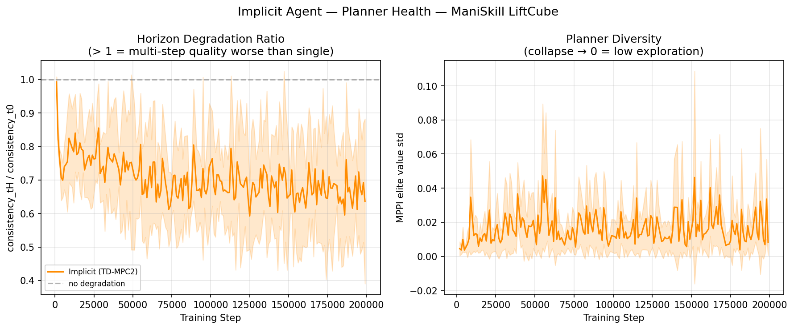 |

---

## Reproducibility

| Script | Purpose |
|---|---|
| `src/train.py` | Train explicit or implicit agent |
| `src/analyze_latents.py` | All latent analyses (probing, geometry, CCA, KL) |
| `src/generate_demos.py` | Generate ManiSkill demos in LeRobot format |
| `src/finetune_smolvla.py` | Fine-tune SmolVLA with LoRA |
| `src/compare_smolvla.py` | SmolVLA vs world-model representation comparison |
| `src/configs/explicit.yaml` | Explicit agent hyperparameters |
| `src/configs/implicit.yaml` | Implicit agent hyperparameters |

**Checkpoints:**
- `logs/explicit/maniskill_LiftCube-v0/seed_{1,2,3}/`
- `logs/implicit/maniskill_LiftCube-v0/seed_{1,2,3}/`

**Analysis outputs:** `analysis_v2/`

**SmolVLA artifacts:**
- Dataset: `data/lerobot/liftcube/` (100 episodes, LeRobot format)
- LoRA weights: `logs/smolvla/liftcube_lora/`
- Comparison plots: `analysis_v2/smolvla/`

### Reproduce latent analysis

```bash
conda run -n .venv_world_models python -u src/analyze_latents.py \
  --explicit_ckpt logs/explicit/maniskill_LiftCube-v0/seed_1/checkpoints/checkpoint_0200000.pt \
  --implicit_ckpt logs/implicit/maniskill_LiftCube-v0/seed_1/checkpoints/checkpoint_0200000.pt \
  --env maniskill_LiftCube-v0 --output analysis_v2/ --seed 1
```

### Reproduce SmolVLA pipeline

```bash
# 1. Generate demos
python src/generate_demos.py --n_episodes 100 --output data/lerobot/liftcube

# 2. Fine-tune SmolVLA
python src/finetune_smolvla.py \
    --dataset data/lerobot/liftcube --steps 1000 \
    --output logs/smolvla/liftcube_lora

# 3. Compare representations
python src/compare_smolvla.py \
    --explicit_ckpt logs/explicit/maniskill_LiftCube-v0/seed_1/checkpoints/checkpoint_0200000.pt \
    --implicit_ckpt logs/implicit/maniskill_LiftCube-v0/seed_1/checkpoints/checkpoint_0200000.pt \
    --smolvla_lora logs/smolvla/liftcube_lora \
    --output analysis_v2/smolvla/
```

---

## References

1. Cadene et al. *SmolVLA: A compact vision-language-action model for affordable robotics.* arXiv:2506.01844, 2025.
2. Gu et al. *ManiSkill2: A unified benchmark for generalizable manipulation skills.* ICLR, 2023.
3. Ha & Schmidhuber. *World Models.* arXiv:1803.10122, 2018.
4. Hafner et al. *Dream to control: Learning behaviors by latent imagination.* ICLR, 2020.
5. Hafner et al. *Mastering diverse domains through world models.* arXiv:2301.04104, 2023.
6. Hansen et al. *TD-MPC2: Scalable, robust world models for continuous control.* arXiv:2310.16828, 2024.
7. Kornblith et al. *Similarity of neural network representations revisited.* ICML, 2019.
8. Tunyasuvunakool et al. *dm\_control: Software package for physics-based simulation in continuous control.* Software Impacts, 2020.
